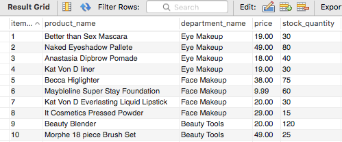

## **Welcome to BAMAZON**

### Node.js & MySQL

Here I have created an Amazon-like storefront using Node.js and MySQL. 
This app will take in orders from customers and adjust the inventory accordingly. 

Node Packages Used: 
* MySQL
* Node.js
* Inquirer
* CLI Table
* Colors

### Getting Started

Starting off with running the program `node bamazonCustomer.js`
This will display all the items in the inventroy which matches the MySQL data

MySQL Table

Bamazon Table

Next It will prompt you to chose a product ID

Then you are asked to specify an amount for the purchase

If there isn't enough invetory you will receive an alert in red

